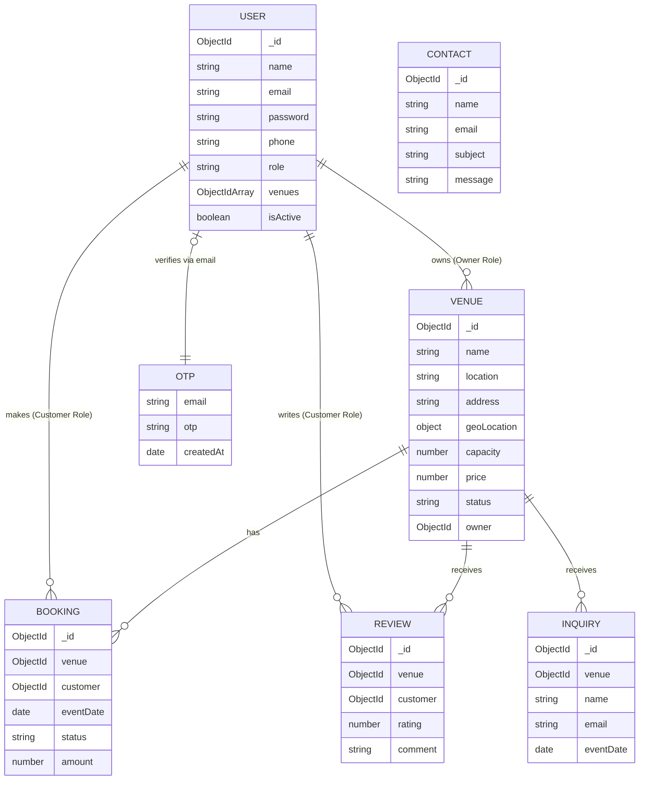

# Database Entity-Relationship Diagram (ERD)

This document visualizes the relationships between the database models in the **Swat-Venue** platform.

## 1. ERD Visualization

## 2. Relationship Explanations

### 2.1 User & Venue (One-to-Many)
*   **Relationship:** A **User** with the role `owner` can own multiple **Venues**.
*   **Implementation:** The `Venue` model stores the `owner` ID, and the `User` model stores an array of `venue` IDs.

### 2.2 User & Booking (One-to-Many)
*   **Relationship:** A **User** with the role `customer` can create multiple **Bookings**.
*   **Implementation:** The `Booking` model stores the `customer` ID.

### 2.3 Venue & Booking (One-to-Many)
*   **Relationship:** A **Venue** can have many **Bookings** scheduled on different dates.
*   **Implementation:** The `Booking` model references the `venue` ID.

### 2.4 Venue & Review (One-to-Many)
*   **Relationship:** A **Venue** accumulates many **Reviews** over time.
*   **Implementation:** The `Review` model references the `venue` ID. When a review is created, the average rating is recalculated on the `Venue` document.

### 2.5 User & OTP (One-to-One / Transient)
*   **Relationship:** An **OTP** is linked to a **User** via their `email`.
*   **Implementation:** Used during the "Forgot Password" flow. It is a transient relationship as the OTP document auto-expires after 10 minutes.

### 2.6 Inquiry & Contact (Standalone/External)
*   **Inquiry:** Linked to a **Venue** so owners can respond to specific event questions.
*   **Contact:** Standalone messages sent to platform **Administrators** for general support.
